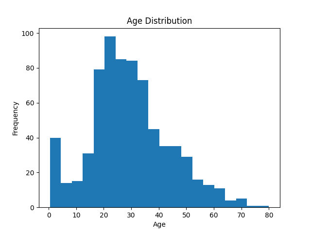
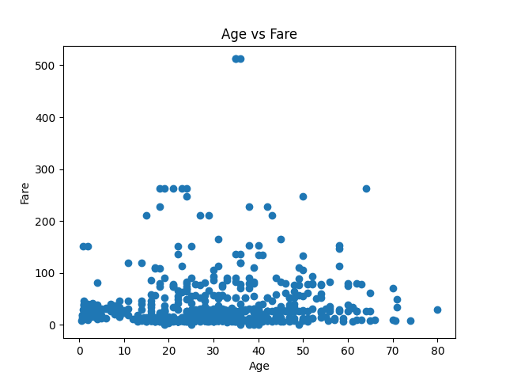

```markdown
# Comprehensive Insights Report: Titanic Dataset Analysis

## Introduction

This report consolidates findings from statistical analysis, anomaly detection, and visualization tasks performed on the Titanic dataset. It aims to provide actionable insights and recommendations for improving data quality, guiding further analysis, and potentially enhancing the overall data processing pipeline.

## Statistical Analysis

### Summary of Descriptive Statistics

| Feature       | Mean   | Median | Std Dev | Range       | IQR    |
|---------------|--------|--------|---------|-------------|--------|
| PassengerId   | 446.00 | 446.00 | 257.35  | 1.00-891.00 | 445.00 |
| Survived      | 0.38   | 0.00   | 0.49    | 0.00-1.00   | 1.00   |
| Pclass        | 2.31   | 3.00   | 0.84    | 1.00-3.00   | 1.00   |
| Age           | 29.70  | 28.00  | 14.53   | 0.42-80.00  | 17.88  |
| SibSp         | 0.52   | 0.00   | 1.10    | 0.00-8.00   | 1.00   |
| Parch         | 0.38   | 0.00   | 0.81    | 0.00-6.00   | 0.00   |
| Fare          | 32.20  | 14.45  | 49.69   | 0.00-512.33 | 23.09  |

### Interpretation

-   **Central Tendency:** The mean and median values provide insights into the typical values for each feature. For instance, the median age being close to the mean suggests a roughly symmetrical distribution, while the difference between the mean and median for 'Fare', 'SibSp', and 'Parch' indicates right-skewness.
-   **Variability:** Standard deviation measures the spread of the data. Higher standard deviations in 'Age' and 'Fare' suggest greater variability compared to 'Pclass'. IQR provides another measure of spread, less sensitive to outliers.
-   **Overall Data Distribution:** The combination of mean, median, standard deviation, and IQR helps understand the shape of the distribution. Right-skewed distributions are evident in 'Fare', 'SibSp', and 'Parch', while 'Age' appears closer to a normal distribution.

### Correlations
Due to the limitation of not having the correlation matrix, I'll provide a general guidance.
To analyze correlations, a correlation matrix should be computed. Positive correlation indicates that as one variable increases, the other tends to increase as well. Negative correlation indicates that as one variable increases, the other tends to decrease. Analyze the correlation between 'Survived' and other features like 'Pclass', 'Age', and 'Fare' to understand their influence on survival rates.

## Anomaly Detection

### Summary of Detected Anomalies

| Feature     | Anomaly Type          | Count (Approximate) | Characteristics                               | Recommendations                                                                                                |
|-------------|-----------------------|---------------------|-----------------------------------------------|--------------------------------------------------------------------------------------------------------------|
| Age         | Extreme Values, IQR   | High                | Values > 65                                     | Verify, cap, or trim extreme ages. Impute missing values.                                                   |
| SibSp       | IQR                   | Moderate            | Values > 2.5 (3, 4, 5, 8)                       | Investigate large families. Consider feature engineering.                                                    |
| Parch       | IQR                   | High                | Values > 0 (1, 2, 3, 4, 5, 6)                       | Investigate large families. Consider feature engineering.                                                    |
| Fare        | Extreme Values, IQR   | High                | Values > 65.5                                    | Verify high fares. Analyze fare distribution by class. Consider logarithmic transformation.                 |

### Implications

-   **Data Quality:** Anomalies can indicate data entry errors or unusual but valid data points. Addressing these anomalies is crucial for improving data quality.
-   **Potential Errors:** Extreme values in 'Fare' or 'Age' could be due to errors in data collection or recording.
-   **Skewness:** Outliers in 'SibSp', 'Parch', and 'Fare' contribute to skewness, potentially affecting linear model performance.

## Visualizations

### Embedded Visualizations and Annotations

#### Age Distribution


*Annotation:* The age distribution shows a concentration of passengers in their 20s and 30s. The distribution is slightly right-skewed, with a few older passengers. Missing values should be imputed to avoid bias.

#### Fare Distribution


*Annotation:* The fare distribution is heavily right-skewed with numerous outliers, indicating a wide range of ticket prices and potential premium fares. Log transformation may be useful.

#### SibSp Distribution


*Annotation:* Most passengers traveled alone (SibSp=0). Outliers suggest a few passengers traveled with many siblings/spouses. This could be simplified into a "travelled alone" boolean feature.

#### Parch Distribution


*Annotation:* Similar to SibSp, most traveled without parents/children. Consider combining SibSp and Parch into a family size feature.

#### Pclass Distribution


*Annotation:* The majority of passengers were in Pclass 3. This feature is strongly related to survival and fare, so analyze it carefully.

#### Age vs Fare


*Annotation:* No clear correlation between Age and Fare is apparent from the scatter plot. Higher fares are paid by a few passengers irrespective of age.

## Insights & Recommendations

### Data Quality Improvements

1.  **Missing Value Imputation:** Address missing values in the 'Age' column using appropriate imputation techniques (e.g., mean, median, or regression imputation).
2.  **Outlier Handling:** Apply outlier handling techniques to 'Fare', 'SibSp', 'Parch', and 'Age'. Consider winsorizing, trimming, or transformations.
3.  **Data Cleaning:** Investigate and correct any data entry errors, especially for extreme values in 'Age' and 'Fare'.

### Further Analysis

1.  **Survival Analysis:** Conduct survival analysis to identify factors that significantly influenced survival rates. Consider variables like 'Pclass', 'Age', 'Sex', and 'Fare'.
2.  **Correlation Analysis:** Calculate the correlation matrix to understand the relationships between different variables, including the correlation between 'Survived' and other features.
3.  **Fare Analysis:** Further investigate the 'Fare' column to understand the reasons for the high variability and outliers. Analyze fare distributions by passenger class or other relevant factors.

### Predictive Modeling

1.  **Classification Models:** Develop classification models to predict survival based on various features. Consider algorithms like logistic regression, decision trees, or support vector machines.
2.  **Feature Engineering:** Create new features based on 'SibSp' and 'Parch' (e.g., family size, is_alone) to potentially improve model performance. Also, convert categorical features into numerical ones using techniques like one-hot encoding.

### Data Processing Pipeline Improvements

1.  **Automated Anomaly Detection:** Implement automated anomaly detection processes to identify and flag unusual data points in real-time.
2.  **Data Validation:** Incorporate data validation steps to ensure data quality and consistency.
3.  **Data Transformation:** Automate data transformation steps like logarithmic transformation for skewed features.

## Opportunities for Predictive Modeling and Further Exploratory Analysis

Based on the findings, there are several opportunities for predictive modeling and further analysis:

-   **Predictive Modeling:** Develop models to predict survival based on features like 'Pclass', 'Age', 'Sex', 'Fare', 'SibSp', and 'Parch'.
-   **Exploratory Analysis:**
    -   Analyze the relationship between 'Pclass' and survival rate.
    -   Investigate the impact of family size (combined 'SibSp' and 'Parch') on survival.
    -   Explore the distribution of 'Fare' within each 'Pclass'.

## Conclusion

This comprehensive insights report provides a foundation for improving data quality, conducting further analysis, and building predictive models for the Titanic dataset. By addressing the identified anomalies and implementing the recommended actions, the user can gain a deeper understanding of the data and potentially improve the accuracy and reliability of future analyses.
```