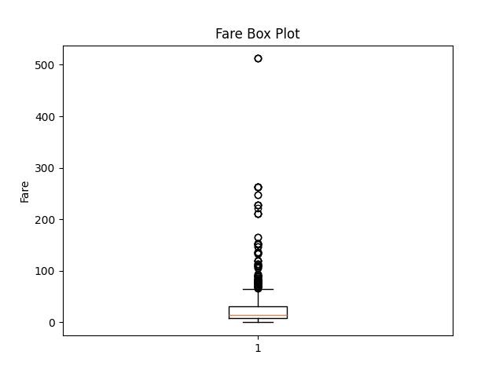
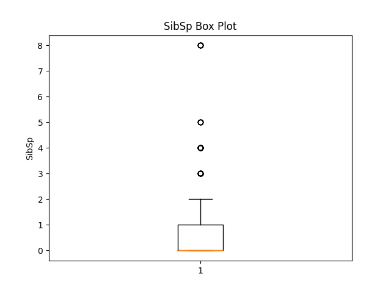
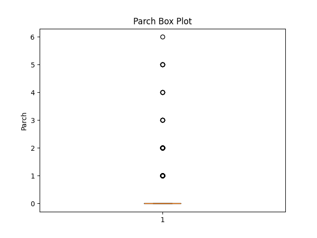
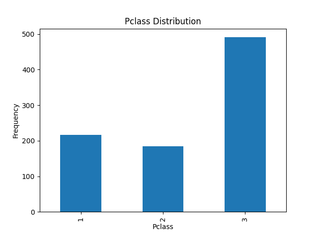
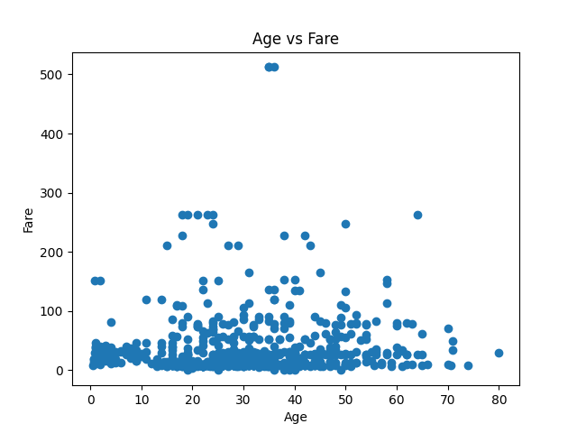

# Titanic Dataset Visualization Report

## Age Distribution

The age distribution is approximately normal, with a slight right skew. There are more passengers in their 20s and 30s. There are fewer passengers who are very young or very old.

## Fare Distribution

The fare distribution is heavily right-skewed, with many outliers. This indicates that most passengers paid relatively low fares, while a few passengers paid very high fares. This could be due to differences in class or other factors.

## SibSp Distribution

The SibSp distribution is right-skewed, with most passengers traveling without siblings or spouses. There are some outliers, indicating passengers who traveled with a large number of siblings or spouses.

## Parch Distribution

The Parch distribution is right-skewed, with most passengers traveling without parents or children. There are some outliers, indicating passengers who traveled with a large number of parents or children.

## Pclass Distribution

Most passengers were in Pclass 3, followed by Pclass 1 and then Pclass 2. This suggests that the majority of passengers were in the lower classes.

## Age vs Fare

There is no strong correlation between age and fare. However, there appears to be a cluster of passengers who paid high fares, regardless of their age. These are likely the passengers in Pclass 1.

## Recommendations
- Handle outliers in Fare, SibSp, and Parch using capping or transformation techniques.
- Investigate the relationship between Pclass and survival rate further.
- Consider feature engineering to combine SibSp and Parch into a family size feature.
